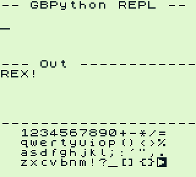

# GBPython

A Python interpreter that runs on the Nintendo Game Boy (DMG).

Programs are typed on an on-screen keyboard and executed by a tree-walking
interpreter running on the Game Boy's 4 MHz LR35902 CPU, with the AST,
strings, lists, and dicts arena-allocated in banked cartridge SRAM. It is,
within the limits of a machine with 8 KB of work RAM, a real Python:
floats, 32-bit ints, real `True`/`False`/`None`, exceptions, functions
with recursion and lexical scoping, classes, tuples, dicts, sets,
`import math`, and a REPL that echoes exactly like CPython's.



```python
def fib(n):
    if n<2: return n
    return fib(n-1)+fib(n-2)
```

Press Start. Then just call `fib(10)` in your next program — definitions
persist across runs, like a real REPL.

## Language

- **Types**: 32-bit ints, IEEE-754 single-precision floats, strings (up to
  127 chars), lists, tuples, dicts, sets, objects, `True` / `False`, `None`
- **Arithmetic** with Python 3 semantics: `/` is true division and returns
  a float (`17/5` echoes `3.4`, `8/2` echoes `4.0`), `//` floors
  (`-7//2 == -4`), `%` takes the divisor's sign (`-7%2 == 1`). The floats
  are a hand-rolled soft-float — GBDK ships no float library for the
  Game Boy's CPU, so GBPython carries its own.
- **Comparisons** produce real bools, chain with single evaluation and
  short-circuit (`1 <= x <= 10`), compare strings lexicographically and
  lists/tuples/dicts/sets by content
- **Membership**: `in` / `not in` for sequences, dict/set keys, substrings
- **Logic**: `and` / `or` / `not` with Python value semantics and Python
  truthiness (`''`, `[]`, `{}`, `()`, `0`, `0.0`, `None` are falsy)
- **Control flow**: `if` / `elif` / `else`, `while`,
  `break` / `continue` / `pass`, `for x in range(...) | list | tuple |
  string | dict | set`
- **Functions**: `def` with `return`, recursion (`RecursionError` at depth
  16), arity checking, the `global` keyword, and Python lexical scoping —
  assignment creates a local, reads see the current frame and globals
  only. Definitions persist across runs, like a real REPL.
- **Classes**: `class Name:` and single inheritance `class Sub(Base):`
  with methods, `__init__`, `self`, attribute get/set (`obj.attr`,
  `obj.attr = v`), `AttributeError`, `<Name>` repr
- **Exception handling**: `try:` / `except:` / `except NameError:` with
  multiple clauses, and `raise ValueError('message')`
- **Methods**: `'x'.upper()` `.lower()` `.strip()` `.find()` `.split()`
  `.replace()`, dict `.get(k, default)` `.keys()` `.values()`,
  list/tuple `.index()` `.count()`
- **Assignment**: plain, augmented (`+= -= *= /= //= %=`), multiple
  (`a, b = 1, 2`), swap (`a, b = b, a`), sequence unpacking
  (`a, b = pair`)
- **Sequences**: indexing and slicing with negative indices, `+`
  concatenation, iteration; tuples are immutable; `a[i] = v` and dict
  aliasing (`e = d; e[1] = 2` visible through `d`) work like Python
- **Exceptions** (reported, then the run stops): `NameError: x`,
  `ZeroDivisionError`, `IndexError`, `KeyError`, `AttributeError`,
  `TypeError`, `ValueError`, `RecursionError`, `SyntaxError`,
  `ModuleNotFound`, and `MemoryError` (which wipes all state)
- **`import`**: a small stdlib is baked into ROM as gbpython source and
  compiled on import — `import math` (`pi`, `e`, `sqrt`, `floor`, `ceil`,
  `gcd`), `import random` (`seed`, `randint`)
- **Builtins**: `print()`, `input()` (pauses the program and reads a line
  from the on-screen keyboard), `len()`, `abs()`, `str()`, `int()`,
  `float()`, `round()`, `chr()`, `ord()`, `min()`, `max()`, `sum()`
- Indentation-based blocks, single-line suites after `:` with `;`
  separators, `#` comments
- REPL echo: expression statements echo as `> value`; `None` echoes
  nothing, exactly like CPython

**Remaining deviations from CPython**: ints are 32-bit and wrap (no
bignums), floats render with 4 decimal places, dict keys can't be floats,
functions/methods take at most 4 parameters, `round()` rounds half away
from zero, exceptions match by name rather than by class hierarchy, and
there is no multiple inheritance, `super()`, `finally`, f-strings,
generators, or `list.append` (lists are fixed-size; use `a += [x]`).

## Controls

| Button | Action |
|---|---|
| D-pad | Move keyboard cursor (wraps at row ends) |
| A | Type character (▶ key = run the program) |
| Select + A | Shift: type uppercase letter |
| B | Backspace |
| Select (tap) | Space |
| Start | Newline (or submit, inside `input()`) |

## Building

Requires [GBDK-2020](https://github.com/gbdk-2020/gbdk-2020) (expected at
`~/gbdk/gbdk`, override with `GBDK_HOME`).

```sh
make        # builds gbpython.gb
make test   # runs the headless emulator test suite
```

The ROM is MBC5 + 32 KB RAM + battery; it runs in any DMG emulator that
models SRAM banking correctly (and on real hardware via a flash cart).

## Testing

The suite ([tests/run_tests.py](tests/run_tests.py)) boots the ROM headlessly
inside [PyGameBoy](https://github.com/Obscuretone/pygameboy) (expected as a
sibling checkout at `../pygameboy`), injects programs into the input buffer
using addresses parsed from the build's `.noi` symbol file, presses Start,
and asserts on text decoded from the background tilemap. Several tests drive
the real on-screen keyboard end-to-end — including one that answers an
`input()` prompt mid-program. The programs in [examples/](examples/) run as
part of the suite, checked against their `# expect:` comments.

```
180/180 passed
```

See [docs/ARCHITECTURE.md](docs/ARCHITECTURE.md) for how the interpreter
fits in 64 KB of ROM and 32 KB of cartridge SRAM.
